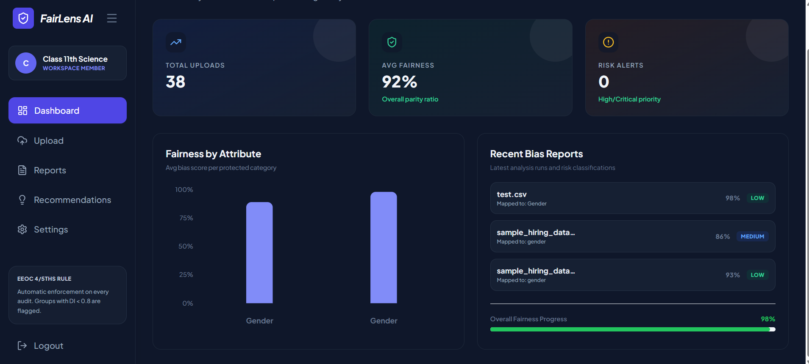
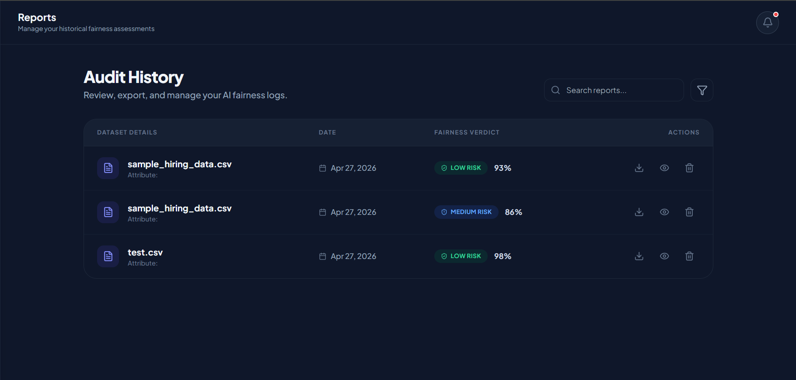

# 🌟 FairLens AI


## 🚀 AI-Powered Hiring Bias Detection Platform

**FairLens AI** is an intelligent fairness auditing platform that helps organizations detect, measure, and reduce bias in hiring decisions using historical recruitment datasets.

Built for the **Google Developer Groups Solution Challenge 2026**, FairLens AI promotes ethical AI and inclusive hiring.

---

## 🌍 UN Sustainable Development Goals

✅ **Goal 5 – Gender Equality**  
Detect gender-based disparities in recruitment outcomes.

✅ **Goal 8 – Decent Work & Economic Growth**  
Promote fair and inclusive hiring opportunities.

✅ **Goal 10 – Reduced Inequalities**  
Identify demographic bias across age, region, and background.

---

## ❗ Problem Statement

Many hiring systems unintentionally inherit bias from historical recruitment data.

This leads to unfair selection practices based on:

- Gender
- Age
- Region
- Background

Organizations often lack accessible tools to detect these issues.

---

## 💡 Our Solution

FairLens AI enables HR teams to upload hiring data and instantly receive:

- Bias Detection Reports
- Fairness Scores
- Demographic Comparison Charts
- Actionable Recommendations
- Responsible AI Insights

---

## ✨ Key Features

### 📊 Smart Bias Dashboard
Upload CSV datasets and analyze fairness instantly.

### 📈 Fairness Metrics
Supports:

- Selection Rate Comparison
- Disparate Impact Ratio
- Group Bias Analysis
- Hiring Outcome Trends

### 🔐 Secure Authentication
Firebase Authentication with protected dashboards.

### ☁️ Cloud Native Architecture
Scalable deployment using Firebase Hosting + Google Cloud Run.

### ⚡ Real-Time Analytics
Interactive charts powered by Recharts + Framer Motion.

---

## 🖼️ Screenshots

> Add dashboard screenshots here

```md

